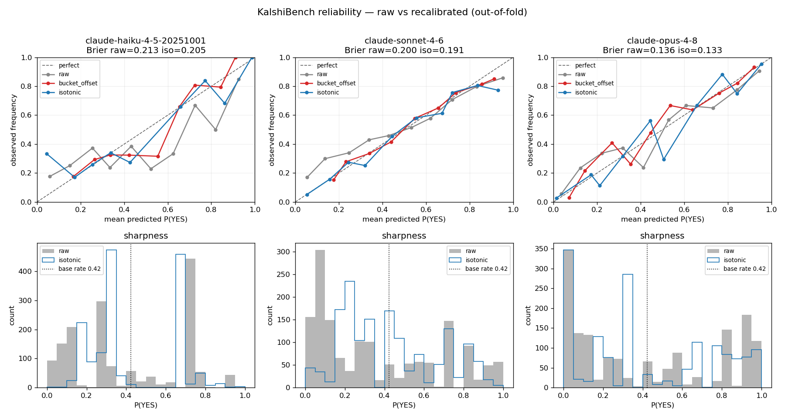
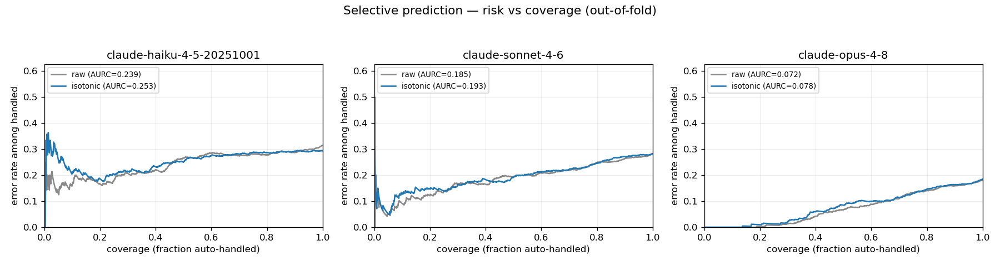

# KalshiBench Calibration Proof-of-Value
_Generated 2026-06-04 05:41 UTC · models: claude-haiku-4-5-20251001, claude-sonnet-4-6, claude-opus-4-8_

## Verdict

**YES.** The project's bucket-offset method significantly lowered out-of-fold Brier on 2/3 models (isotonic: 3/3).

- Isotonic significantly improved Brier on **3/3** models, ECE on **2/3**.
- The project's **bucket-offset** method significantly improved Brier on **2/3** models.
- ⚠️ The bucket-offset map was **non-monotonic on 3/3 models** (it can re-order forecasts / depress AUC) — a structural defect isotonic and Platt avoid by construction.
- See **Selective prediction** below for the act-or-escalate view (auto-handle more at a fixed error rate), and **Calibration by category** for where it helps most.

> **Leakage caveat (read first).** Essentially all KalshiBench questions resolved in 2025 (~98%; the remaining ~2% closed in 2024/2021 — even more firmly inside the cutoff), within the knowledge cutoff of these models, so a model may *recall* outcomes rather than forecast them. These results therefore measure **whether recalibration improves the calibration of the models' stated confidence on these outputs** — they are NOT a forecasting-skill claim on unknown futures. The recalibration question (does a fitted map beat raw confidence out-of-fold?) is still valid; external validity to live forecasting is not established here.

## Results

| Model | Method | n | Brier | BSS | ECE | AUC | ΔBrier (95% CI, cluster) | per-fold↓ | ΔECE (95% CI) | Mono? |
|---|---|--:|--:|--:|--:|--:|---|:--:|---|:--:|
| claude-haiku-4-5-20251001 | raw | 1531 | 0.2132 | +0.127 | 0.0981 | 0.721 | — | — | — | — |
| claude-haiku-4-5-20251001 | bucket_offset | 1531 | 0.2063 | +0.155 | 0.0223 | 0.713 | -0.0069 [-0.0114,-0.0027] improved** | 5/5 | -0.0758 [-0.0899,-0.0337] improved** | **NO** (0.21) |
| claude-haiku-4-5-20251001 | isotonic | 1531 | 0.2045 | +0.162 | 0.0091 | 0.715 | -0.0087 [-0.0131,-0.0043] improved** | 5/5 | -0.0890 [-0.0959,-0.0429] improved** | yes |
| claude-haiku-4-5-20251001 | platt | 1531 | 0.2073 | +0.151 | 0.0432 | 0.718 | -0.0059 [-0.0105,-0.0016] improved** | 5/5 | -0.0549 [-0.0824,-0.0111] improved** | yes |
| claude-sonnet-4-6 | raw | 1531 | 0.2000 | +0.181 | 0.0876 | 0.771 | — | — | — | — |
| claude-sonnet-4-6 | bucket_offset | 1531 | 0.1915 | +0.215 | 0.0265 | 0.767 | -0.0085 [-0.0133,-0.0040] improved** | 5/5 | -0.0610 [-0.0811,-0.0287] improved** | **NO** (0.09) |
| claude-sonnet-4-6 | isotonic | 1531 | 0.1911 | +0.217 | 0.0286 | 0.765 | -0.0088 [-0.0141,-0.0040] improved** | 5/5 | -0.0590 [-0.0762,-0.0297] improved** | yes |
| claude-sonnet-4-6 | platt | 1531 | 0.1907 | +0.219 | 0.0266 | 0.769 | -0.0093 [-0.0144,-0.0045] improved** | 5/5 | -0.0610 [-0.0808,-0.0294] improved** | yes |
| claude-opus-4-8 | raw | 1531 | 0.1364 | +0.441 | 0.0580 | 0.890 | — | — | — | — |
| claude-opus-4-8 | bucket_offset | 1531 | 0.1353 | +0.446 | 0.0485 | 0.887 | -0.0011 [-0.0035,+0.0012] improved | 4/5 | -0.0095 [-0.0222,+0.0108] improved | **NO** (0.15) |
| claude-opus-4-8 | isotonic | 1531 | 0.1329 | +0.455 | 0.0343 | 0.884 | -0.0035 [-0.0066,-0.0004] improved** | 4/5 | -0.0237 [-0.0368,+0.0055] improved | yes |
| claude-opus-4-8 | platt | 1531 | 0.1344 | +0.449 | 0.0479 | 0.888 | -0.0020 [-0.0036,-0.0005] improved** | 4/5 | -0.0101 [-0.0210,+0.0081] improved | yes |

_ΔBrier/ΔECE are (method − raw) on pooled out-of-fold predictions; negative = better. CIs use the **cluster (event) bootstrap**. `**` = 95% CI excludes 0. BSS = Brier Skill Score vs base-rate climatology (>0 beats it). per-fold↓ = folds (of 5) where the method beat raw._

## Selective prediction — act-or-escalate

#### A. Auto-handle more at a fixed error rate (threshold fit on train, scored OOF)

| Model | Target err | raw cov | raw realized | isotonic cov | iso realized | bucket cov | bucket realized |
|---|--:|--:|--:|--:|--:|--:|--:|
| claude-haiku-4-5-20251001 | 5% | 0% | 0.0% | 0% | 0.0% | 0% | 0.0% |
| claude-haiku-4-5-20251001 | 10% | 0% | 0.0% | 1% | 27.3% | 0% | 42.9% |
| claude-sonnet-4-6 | 5% | 0% | 28.6% | 3% | 8.3% | 0% | 0.0% |
| claude-sonnet-4-6 | 10% | 5% | 13.4% | 10% | 13.7% | 5% | 14.6% |
| claude-opus-4-8 | 5% | 41% | 4.8% | 42% | 6.4% | 40% | 4.9% |
| claude-opus-4-8 | 10% | 61% | 9.1% | 66% | 10.5% | 63% | 10.6% |

_Higher coverage at realized error ≤ target is better. Honest finding: a threshold chosen on TRAIN to hit the target tends to **overshoot it out-of-sample** (selective-prediction optimism; only the already-calibrated Opus lands near target). Recalibration usually *increases coverage* but does not by itself guarantee the target is met OOF — so 'auto-handle more at a fixed error rate' is only partially supported here. The cleaner calibration signal is in panel B._

#### B. Honesty at a nominal confidence bar (stated vs realized error, OOF)

| Model | Conf bar | promised err | raw cov / realized | isotonic cov / realized |
|---|--:|--:|--:|--:|
| claude-haiku-4-5-20251001 | ≥80% | 20% | 33% / 20.7% | 18% / 18.1% |
| claude-haiku-4-5-20251001 | ≥90% | 10% | 19% / 17.2% | 0% / 14.3% (n=7) |
| claude-haiku-4-5-20251001 | ≥95% | 5% | 6% / 16.3% | 0% / 0.0% (n=5) |
| claude-sonnet-4-6 | ≥80% | 20% | 59% / 20.6% | 29% / 15.5% |
| claude-sonnet-4-6 | ≥90% | 10% | 39% / 16.7% | 7% / 9.0% |
| claude-sonnet-4-6 | ≥95% | 5% | 22% / 12.7% | 3% / 8.3% |
| claude-opus-4-8 | ≥80% | 20% | 75% / 13.3% | 55% / 10.0% |
| claude-opus-4-8 | ≥90% | 10% | 56% / 8.1% | 35% / 3.3% |
| claude-opus-4-8 | ≥95% | 5% | 38% / 3.1% | 29% / 1.6% |

_At a nominal bar, a calibrated model's realized error should be ≤ the promised error (1−bar). For the more miscalibrated models (Haiku, Sonnet) raw **exceeds** it (overconfident) and recalibration brings realized error to ≤ promised for most cells — but at LOWER coverage (it stops over-claiming). Opus raw is already ≤ promised at every bar (already honest). So recalibration buys *honesty*, not more volume, at a fixed bar. Cells marked (n=…) have few accepted items and are noisy. Class flips vs raw (recal crossing 0.5): haiku: iso=68, bucket=48; sonnet: iso=29, bucket=9; opus: iso=29, bucket=70._

## Calibration by category

| Model | Category | n | raw Brier | iso Brier | raw ECE | iso ECE |
|---|---|--:|--:|--:|--:|--:|
| claude-haiku-4-5-20251001 | Politics | 486 | 0.240 | 0.228 | 0.131 | 0.069 |
| claude-haiku-4-5-20251001 | Entertainment | 322 | 0.186 | 0.181 | 0.079 | 0.045 |
| claude-haiku-4-5-20251001 | Sports | 269 | 0.147 | 0.161 | 0.113 | 0.130 |
| claude-haiku-4-5-20251001 | Elections | 82 | 0.214 | 0.208 | 0.173 | 0.171 |
| claude-haiku-4-5-20251001 | Companies | 79 | 0.277 | 0.256 | 0.178 | 0.130 |
| claude-haiku-4-5-20251001 | Crypto | 71 | 0.240 | 0.210 | 0.208 | 0.072 |
| claude-haiku-4-5-20251001 | Mentions | 52 | 0.272 | 0.242 | 0.249 | 0.198 |
| claude-haiku-4-5-20251001 | Other (<50 each) | 170 | 0.234 | 0.210 | 0.204 | 0.098 |
| claude-sonnet-4-6 | Politics | 486 | 0.203 | 0.191 | 0.118 | 0.063 |
| claude-sonnet-4-6 | Entertainment | 322 | 0.182 | 0.176 | 0.114 | 0.063 |
| claude-sonnet-4-6 | Sports | 269 | 0.137 | 0.145 | 0.042 | 0.086 |
| claude-sonnet-4-6 | Elections | 82 | 0.155 | 0.170 | 0.109 | 0.133 |
| claude-sonnet-4-6 | Companies | 79 | 0.302 | 0.267 | 0.264 | 0.201 |
| claude-sonnet-4-6 | Crypto | 71 | 0.286 | 0.251 | 0.217 | 0.090 |
| claude-sonnet-4-6 | Mentions | 52 | 0.364 | 0.332 | 0.377 | 0.287 |
| claude-sonnet-4-6 | Other (<50 each) | 170 | 0.213 | 0.200 | 0.125 | 0.084 |
| claude-opus-4-8 | Politics | 486 | 0.115 | 0.113 | 0.050 | 0.062 |
| claude-opus-4-8 | Entertainment | 322 | 0.125 | 0.121 | 0.059 | 0.059 |
| claude-opus-4-8 | Sports | 269 | 0.125 | 0.128 | 0.034 | 0.044 |
| claude-opus-4-8 | Elections | 82 | 0.146 | 0.149 | 0.140 | 0.158 |
| claude-opus-4-8 | Companies | 79 | 0.210 | 0.200 | 0.151 | 0.110 |
| claude-opus-4-8 | Crypto | 71 | 0.175 | 0.157 | 0.139 | 0.120 |
| claude-opus-4-8 | Mentions | 52 | 0.340 | 0.319 | 0.351 | 0.338 |
| claude-opus-4-8 | Other (<50 each) | 170 | 0.119 | 0.115 | 0.089 | 0.090 |

_Only categories with n≥50 shown individually (ECE stays noisy below ~100–200); the rest pooled into 'Other'. Descriptive only — many comparisons, not significance-tested._

## Temporal stability (recency probe)

| Model | n train→test | raw Brier | iso Brier | bucket Brier | raw ECE | iso ECE |
|---|---|--:|--:|--:|--:|--:|
| claude-haiku-4-5-20251001 | 878→653 | 0.227 | 0.232 | 0.223 | 0.120 | 0.128 |
| claude-sonnet-4-6 | 878→653 | 0.225 | 0.234 | 0.229 | 0.123 | 0.145 |
| claude-opus-4-8 | 878→653 | 0.190 | 0.205 | 0.204 | 0.107 | 0.146 |

_Chronological holdout: recalibrator fit on the earliest 60% by close_time, scored on the latest 40%. This is an **intra-distribution recency-stability probe, not** leakage-free prospective validation (all questions are within the models' cutoff). Important caveat to the random-CV win: maps fit on earlier items **do not transfer cleanly forward** here (out-of-time Brier is flat-to-slightly-worse), so the random grouped-CV gains are an upper bound on what a fixed deployed map would deliver._

## Diagrams

## Methodology

- **Data:** KalshiBench-v2 (1531 resolved binary
  questions scored per model). Label = 1 if ground_truth == yes.
- **Forecasts:** each model gave a direct P(YES) via a forced tool call (no chain-of-thought,
  for cost + parse reliability + cross-model compatibility), temperature 0.0
  where the model accepts it.
- **Recalibration:** fit on TRAIN, applied to TEST via **grouped 5-fold
  cross-validation** (grouped by event/series_ticker so an event never splits across folds).
  Metrics are computed on pooled out-of-fold predictions; per-fold stability also tracked.
- **Methods:** `raw` (baseline) vs `bucket_offset` (the project's own
  `scoring/recalibration.py` method, reproduced as fit/apply) vs `isotonic` and `platt`
  (standard baselines, sklearn).
- **Metrics:** Brier (primary, proper scoring rule), Brier Skill Score (vs base-rate
  climatology), ECE & adaptive/equal-mass ACE (binning-robust), log-loss, AUC (discrimination —
  a drop signals a non-monotone map). 10 bins. Headline 95% CIs use the **cluster
  (event) bootstrap** (resampling series_ticker, not rows), the unit that respects within-event
  dependence; per-fold improvement counts also shown.
- **Selective prediction (§ below):** (A) operating-point — pick the confidence threshold on
  TRAIN to hit a target error, apply OOF; (B) honesty at a nominal confidence bar. Confidence =
  max(p, 1−p).
- **Per-category & temporal** robustness sections, both descriptive (see their caveats).

> Methodology note: independent reviewers (Codex, Gemini) **disagreed** on the selective
> primary — Gemini favored the nominal-confidence-bar "calibration dividend" view; Codex
> favored the train-chosen-threshold operating point and flagged that realized error at a bar
> is ≤ (1−bar), not ≈. Both views are reported (A and B); neither is over-claimed.

### Honest limitations
- **Leakage** (above) is the dominant threat to external validity; every extension inherits it.
- ECE is a biased, binning-dependent estimator — Brier is primary; ACE can over-state error on
  tied/discrete forecasts, so it is descriptive only.
- Model rows share the same questions, so they are **not independent**; per-model results are
  primary, any cross-model average is descriptive only.
- With KalshiBench-v2's small events (≤2 rows each) the cluster bootstrap is close to a row
  bootstrap; it matters more as events grow. Per-category and temporal tables are descriptive
  (many comparisons / shifting n), not significance-controlled.
- Direct (no-CoT) forecasts may be less sharp than a reasoning agent's; this is a fixed,
  reproducible protocol, not necessarily each model's best possible calibration.
